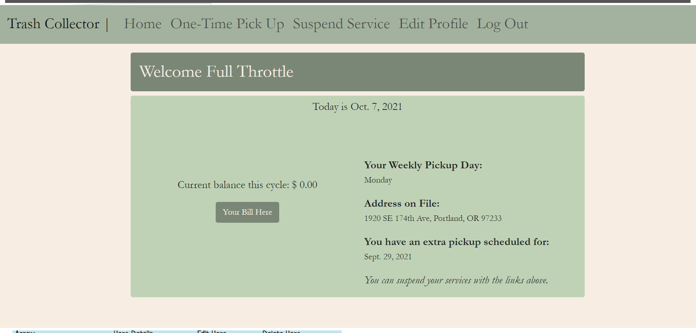

# Trash Collector

Trash Collector is a Django/Python partner project.  The styling was done with a combination of CSS, HTML, and Bootstrap.  The goal of this project was to build the functionality of the employee website and to create an aesthetically pleasing experience for the customer.  

We opted for a simple, clean look because it's much the opposite of what most trash/utility companies are.  A customer can see all of the information they need at a glance.  

In the employee side, the employees only see the people that are in their relevant zip code that need a pick up.  These employees will also see scheduled one time pickups (regardless of zip-code) if it's on their current day.  Employees can also filter their list by day if they want to see what they may have on dock for tomorrow or to answer a customer question.  

